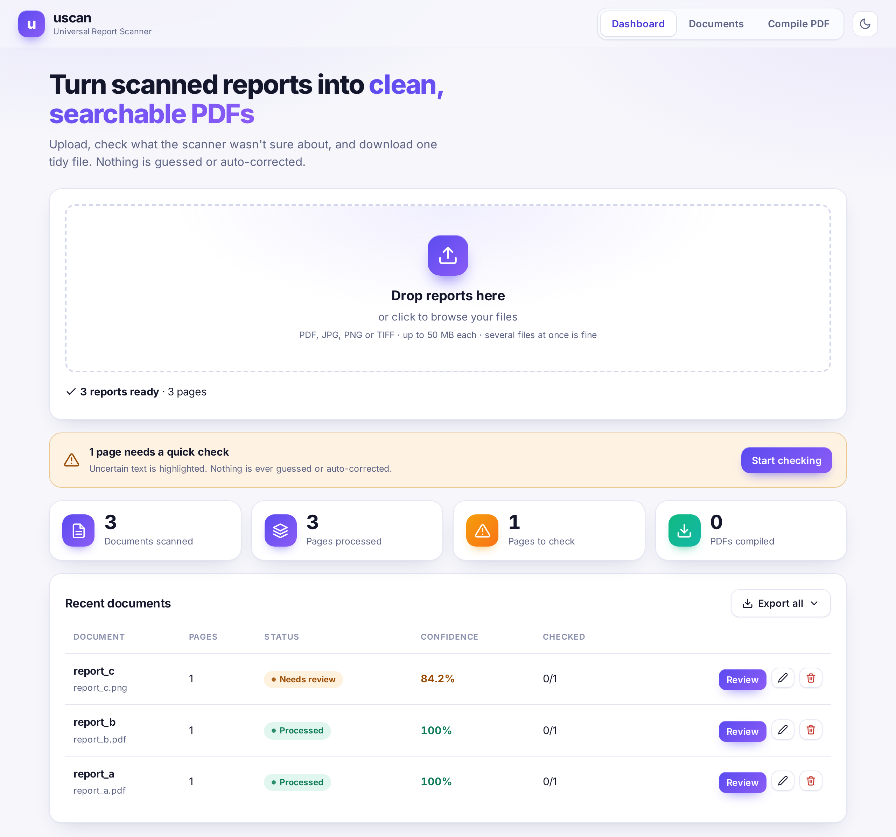
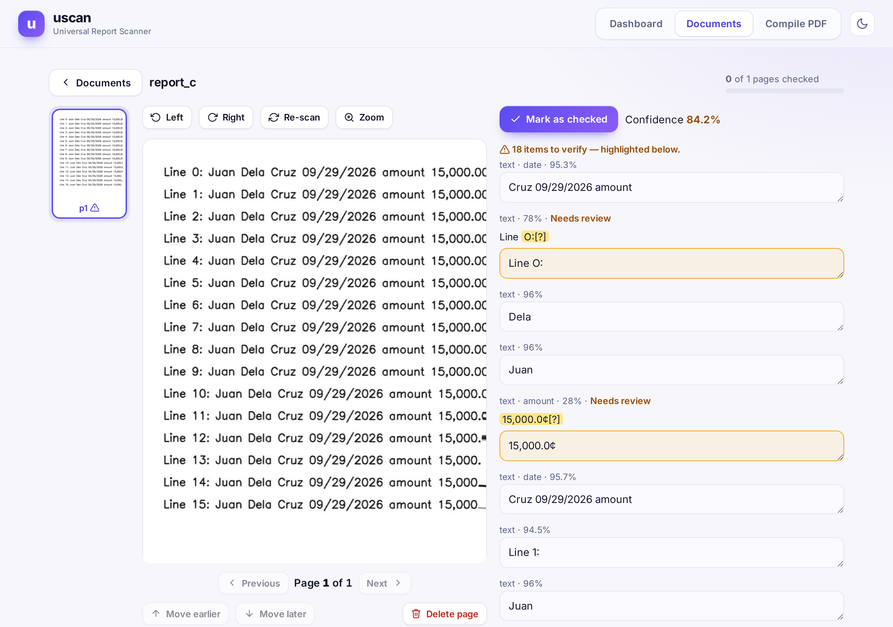
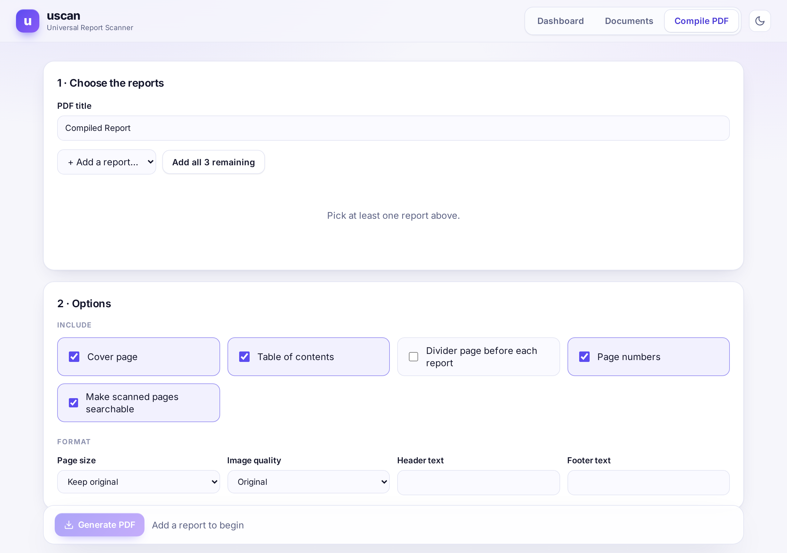
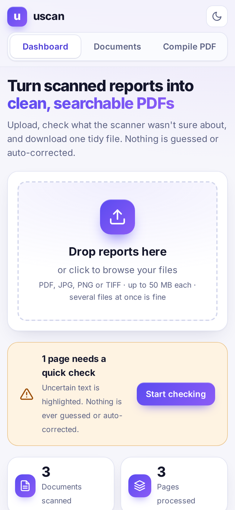
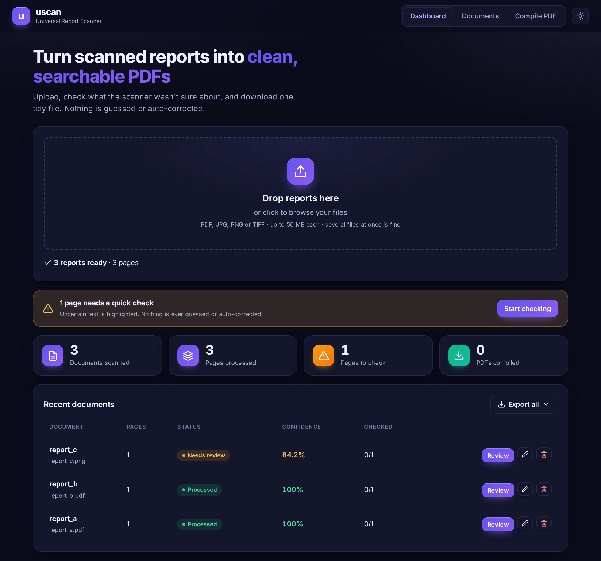

# uscan — Universal Report Scanner

[](https://github.com/imoglobin9-coder/uscan/actions/workflows/ci.yml)
[](LICENSE)


<p align="center"></p>

Upload any report (PDF, JPG, PNG, TIFF) → OCR / text extraction → review & edit → compile → download one PDF.
No report templates: every page is analysed dynamically (text vs. scanned, tables of any shape, any page size).

## Screenshots
| Review & edit | Compile a PDF |
|---|---|
|  |  |

| Mobile | Dark mode |
|---|---|
|  |  |

The UI is responsive (tables become cards on phones) and follows your system light/dark setting; a toggle in the header lets you override it. Fonts are self-hosted ([Inter](https://rsms.me/inter/), SIL OFL — see `static/fonts/OFL-Inter.txt`), so the page loads nothing from third parties and works under the strict CSP.

## Requirements
* Python 3.11+
* **Tesseract OCR** installed (the Python packages don't include it)
  * Windows: install from https://github.com/UB-Mannheim/tesseract/wiki, then set `TESSERACT_CMD` in `.env` if it isn't on PATH
  * macOS: `brew install tesseract` · Ubuntu/Debian: `sudo apt install tesseract-ocr`

## Run
```bash
python -m venv .venv
source .venv/bin/activate        # Windows: .venv\Scripts\activate
cd Uscan/uscan                   # Skip this when you are already on uscan folder
pip install -r requirements.txt
python run.py                    # or: uvicorn app.main:app --reload
```
Open http://127.0.0.1:8000. Launchers: `run_windows.bat`, `run_mac_linux.sh`. Copy `.env.example` to `.env` to configure.

## Sign-in and security
By default uscan listens **only on this computer** (`127.0.0.1`) and needs no password. To add one, set `APP_PASSWORD` in `.env`; the UI then shows a sign-in page.

| Protection | Details |
|---|---|
| Sign-in | Optional `APP_PASSWORD`. Server-side sessions in an `HttpOnly`, `SameSite=Strict` cookie; logout really ends the session; 5 wrong passwords → 5-minute lockout per address. |
| Scripts | Optional `API_KEY`, sent as `X-API-Key` (compared in constant time). If `APP_PASSWORD` is empty it also works as the UI password. |
| Network safety | `run.py` **refuses** a non-local `USCAN_HOST` unless a password is set. Requests whose `Host` isn't in `ALLOWED_HOSTS` are rejected (DNS-rebinding guard). |
| CSRF | Writes with a foreign `Origin` / `Sec-Fetch-Site` are rejected, on top of `SameSite=Strict`. |
| Browser hardening | Strict Content-Security-Policy (no inline scripts/styles, no third-party hosts), `X-Frame-Options: DENY`, `nosniff`, `no-referrer`, `Cache-Control: no-store` on all API responses. The UI builds no inline event handlers and escapes all document text. |
| Uploads | Extension **and** magic bytes checked, size limit enforced while streaming, max files per upload, UUID storage names, decompression-bomb limit (`MAX_IMAGE_PIXELS`), capped PDF render size, OCR timeouts. |
| Edits | The server only accepts changed *text* for known lines/cells; structure, ids and flags are never taken from the client. |
| Files on disk | Data folders are created owner-only (`0700`) on macOS/Linux. |
| API docs | `/docs` is off unless `ENABLE_DOCS=true`. |

In public mode every document, page, job and PDF also belongs to exactly one workspace, and every route checks that (`tests/test_public.py`).

Not covered: documents are **not encrypted at rest**, and PDFs are parsed by PyMuPDF/Tesseract in-process — only upload files you would open on this machine anyway. If you serve uscan beyond localhost, put it behind HTTPS (and set `COOKIE_SECURE=true`).

## How it works
| Step | Module |
|---|---|
| Validate + store upload (extension, magic bytes, size limit, UUID name) | `utils/security.py`, `utils/file_utils.py` |
| Selectable text? extract directly; otherwise render + preprocess (crop dark borders, deskew, upscale, denoise, contrast/adaptive threshold, OSD rotation) | `services/document_service.py`, `image_service.py`, `pdf_service.py` |
| OCR with per-word confidence (pluggable engines: Tesseract, optional EasyOCR) | `services/ocr_service.py` |
| Tables: ruled grids via OpenCV line detection (with column spans), else borderless alignment analysis | `services/table_service.py` |
| Review UI: edit lines/cells (auto-saved), rotate, rescan, delete (with undo), reorder, mark checked, jump to the next page that needs a look, arrow-key page switching | `static/js/app.js`, `api/documents.py` |
| Compile: cover, TOC, separators, headers/footers, page numbers, page sizes, quality; scanned pages get an invisible OCR text layer | `services/compilation_service.py`, `pdf_service.py` |

Words below `LOW_CONF` (default 70) are marked **Needs Review** and shown as `word[?]`. Nothing is auto-corrected or guessed.
Originals are never modified; compilations are new files in `data/compilations/`.

## API
`POST /api/documents/upload` · `GET /api/documents` · `GET|PUT|DELETE /api/documents/{id}` · `GET /api/documents/{id}/pages` · `POST /api/documents/{id}/process` ·
`PUT /api/documents/{id}/order` · `PUT|DELETE /api/pages/{id}` · `POST /api/pages/{id}/rotate|rescan` · `DELETE /api/workspace` (public mode: delete all my data) · `GET /healthz` · `GET /privacy` · `POST /api/pages/{id}/restore` · `GET /api/session` · `POST /api/login|logout` · `GET /api/jobs/{id}` · `GET /api/stats` ·
`GET /api/export/text?format=txt|pdf` (all extracted text in one text-only file) · `POST /api/compilations/merge-all` (merge every processed report into one PDF) · `POST|GET /api/compilations` · `GET /api/compilations/{id}` · `POST /api/compilations/{id}/export` · `GET /api/compilations/{id}/download`

Set `ENABLE_DOCS=true` for interactive docs at `/docs`. When `APP_PASSWORD` / `API_KEY` is set, every `/api` call needs the session cookie or an `X-API-Key` header (`utils/security.require_auth`).

## Tests
`pytest` (`tests/conftest.py` isolates the data folder; unit tests always run; the end-to-end upload→PDF test runs when Tesseract and all dependencies are installed).
`python tests/make_samples.py` writes sample reports with different layouts to `data/samples/`.
`python scripts/screenshots.py` (needs `pip install playwright && playwright install chromium`) regenerates the README screenshots.

## Known limits
Handwriting depends on what Tesseract can read; rowspans in tables and perspective correction are not implemented; OCR text-layer editing on digital PDFs is not embedded (their original text is kept as-is).

## Contributing
Issues and pull requests are welcome. Run `pytest` before opening a PR; CI runs the same tests (with Tesseract installed) on Python 3.11 and 3.12. Never commit `.env` or anything under `data/` — both are git-ignored.

## License
[MIT](LICENSE)
